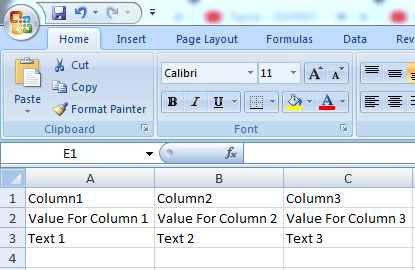
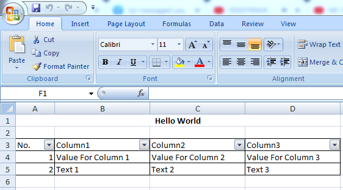

### Introduction

**PhpSpreadsheetExcel** is a package thats offers you to build Excel fast and easy in PHP.

This package depends on [PHPOffice/PhpSpreadsheet](https://github.com/PHPOffice/PhpSpreadsheet).

### Installation
* composer require **gentritabazi01/phpspreadsheetexcel**.

### Usage

[Example 1](src/Examples/example-01.php):

```php
<?php

use GentritAbazi\PhpSpreadsheetExcel\Services\PhpSpreadsheetExcelService;

$columns = ['Column1', 'Column2', 'Column3'];
$rows = [
    ['Value For Column 1', 'Value For Column 2', 'Value For Column 3'],
    ['Text 1', 'Text 2', 'Text 3']
];
$config = [];

$spreadsheetExcel = new PhpSpreadsheetExcelService($columns, $rows, $config);
$spreadsheetExcel->save('file.xlsx');
```

Output:




[Example 2](src/Examples/example-02.php):

```php
<?php

use GentritAbazi\PhpSpreadsheetExcel\Services\PhpSpreadsheetExcelService;

$columns = ['Column1', 'Column2', 'Column3'];
$rows = [
    ['Value For Column 1', 'Value For Column 2', 'Value For Column 3'],
    ['Text 1', 'Text 2', 'Text 3']
];
$config = [
    'title' => 'Hello World',
    'auto_numbering' => true,
    'columns_autosize' => true,
    'columns_auto_filter' => true,
    'borders' => true
];

$spreadsheetExcel = new PhpSpreadsheetExcelService($columns, $rows, $config);
$spreadsheetExcel->save('file.xlsx');
```

Output:



### Available Functions
* stream.
* streamAsCsv.
* save.
